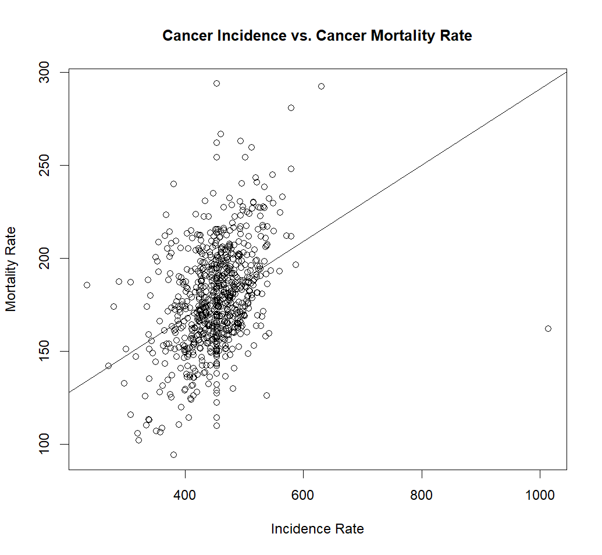
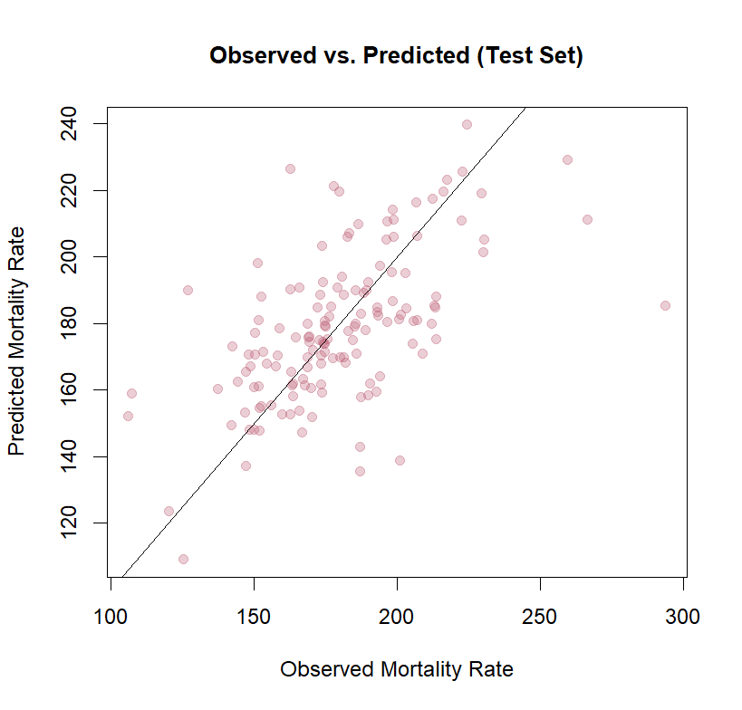

# Cancer Mortality Analysis (R, Multivariable Regression)

This project analyzes U.S. county-level cancer mortality data from Kaggle to explore how demographic,
socioeconomic, and healthcare-related factors relate to cancer death rates. The analysis focuses on
cleaning, merging, visualizing, and modeling the data using multivariable regression and robustness checks.

---

## Data
- *Source:* https://www.kaggle.com/datasets/varunraskar/cancer-regression
- *Unit of analysis:* U.S. counties (3,047 rows before cleaning)
- *Files used:*
  - cancer_reg.csv – cancer mortality, incidence, and demographic variables
  - avg-household-size.csv – average household size by county

### Cleaning steps

In scripts/data_cleaning_eda.R:

- Merged the two CSVs on geography.
- Dropped non-analytic identifier columns such as geography, statefips, countyfips, and text bins.
- Kept only numeric predictors and removed rows with missing values.
- Removed obviously impossible observations (e.g., median age > 120).
- Saved the cleaned dataset as merged_clean.RDATA.

After cleaning, the dataset has:

- No missing values in the predictors used for modeling.
- Reasonable ranges for all variables.

---

## Exploratory Data Analysis

Key EDA steps in scripts/data_cleaning_eda.R:

- Plotted the distribution of cancer mortality (target_deathrate), which is roughly centered around
  180 deaths per 100,000 but with a long right tail.
- Visualized the relationship between *cancer incidence* and *cancer mortality* – a clear positive
  trend, confirmed by adding a simple regression line.
- Computed a correlation matrix for selected predictors. A few strong patterns:
  - pctprivatecoverage and pctempprivcoverage are highly correlated (~0.83).
  - pctwhite and pctblack are strongly negatively correlated (~–0.82).
  - Education and insurance variables show moderate correlations, indicating some multicollinearity.

---

## Modeling

All modeling code lives in scripts/modeling_diagnostics.R.

### Stepwise model selection

- Fit a *full OLS model* with target_deathrate as the response and all cleaned predictors.
- Fit a *null model* with only an intercept.
- Used step() with forward, backward, and both-direction selection based on F-tests.
- Chose the *backward-selected model* as the final OLS model:

  ```r
  final <- backward
  final.form <- formula(final)

### Key Visualizations

*Distribution of cancer mortality*


*Incidence vs. mortality*



*Residual diagnostics*


*Observed vs predicted (test set)*



## How to Run

1. Open scripts/data_cleaning_eda.R to reproduce cleaning and EDA.
2. Open scripts/modeling_diagnostics.R to run regression models, robustness checks, and generate figures.
3. Ensure the data/ folder contains:  
   - cancer_reg.csv  
   - avg-household-size.csv

All results (coefficients, diagnostics, and plots) are reproduced directly by running the scripts in order.

## Dependencies
R packages used: car, MASS
